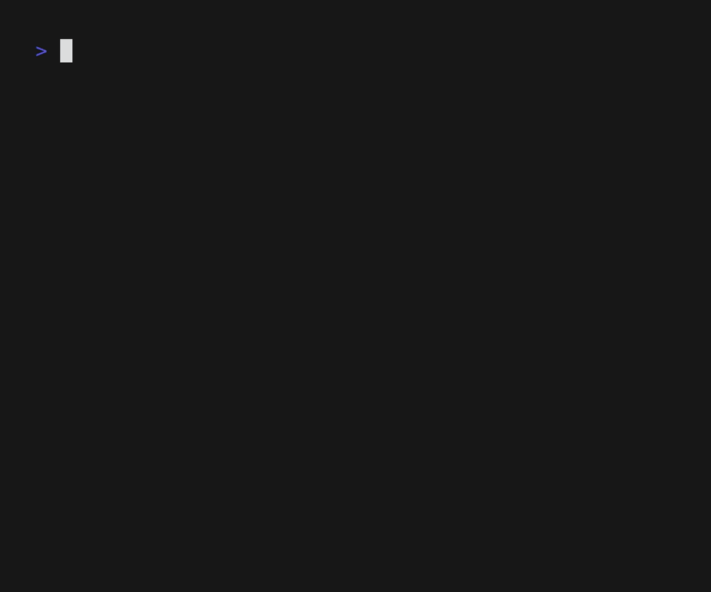

<div align="center">

# 🥔 dotato
dotato is a lightweight dotfile manager.



</div>


## Introduction
> [!CAUTION]
> Dotato is in alpha release. Always backup before using dotato.

🥔 dotato is simple.
- Select dotfiles with config file
- Move dotfiles to your directory

✏️ Config files are clear.
- `dotato.yaml`: declare original path of dotfiles
- `.dotatoignore`: select files that you need

🚚 Choose command mode.
- **file mode**: copy dotfiles into your directory (like snapshot)
- **link mode**: move dotfiles into your directory and leave symlink instead. (like [stow](https://www.gnu.org/software/stow/))

## OS Support
<table>
  <tr>
    <th>OS</th>
    <th>Support</th>
  </tr>
  <tr>
    <td>Linux</td>
    <td>✅</td>
  </tr>
  <tr>
    <td>MacOS</td>
    <td>✅</td>
  </tr>
  <tr>
    <td>Windows</td>
    <td>
      <p>File mode: ⚠️</p>
      <ul>
        <li>It works with local drive. e.g. 'C:\'</li>
        <li>It doesn't work with network path. e.g. '\\wsl.localhost\'</li>
      </ul>
      <p>Link mode: ❌</p>
      <ul>
        <li>Any command that deletes symlink will fail.</li>
      </ul>
    </td>
  </tr>
  
</table>


## Installation
### With Go
dotato is written in pure go. If you have [go](https://go.dev/dl/), it is easy:
```console
> go install github.com/msisdev/dotato@latest
```

Make sure you have `~/go/bin` in env var path.


## Tutorial (file mode)
Your dotato directory will look like this.
```
📁
├── 📁bash
│   └── 📄.dotatoignore
└── ⚙️dotato.yaml
```

Configure `dotato.yaml` to tell dotato where to order/deliver files from/to.
```yaml
# dotato.yaml
version: 1.0.0

mode: file

plans:
  all:  # empty plan means all groups

groups:
  bash:
    nux: "~"
```

Configure `bash/.dotatoignore` to tell which files to ignore/grab.
```gitignore
#.dotatoignore
*         # ignore all
!.bashrc  # grab .bashrc
```

Copy files into dotato directory:
```console
> dotato import group bash nux
✔ Mode: file
✔ Group bash: /home/msisdev
✔ Preview bash done

🔎 Preview: update 1 / total 1

▐o▌/home/msisdev/.bashrc
 ->▐c▌/home/msisdev/Documents/GitHub/dotato/bash/.bashrc

▐o▌ okay / ▐s▌ skip / ▐c▌ create / ▐w▌ overwrite

Do you want to proceed?

> yes 

✔ Done
```
```
📁
├── 📁bash
│   ├── ✨.bashrc
│   └── 📄.dotatoignore
└── ⚙️dotato.yaml
```

Copy dotato files back to their original place:
```console
> dotato export group bash nux
✔ Mode: file
✔ Group bash: /home/msisdev
✔ Preview bash done

🔎 Preview: update 1 / total 1

▐w▌/home/msisdev/.bashrc
 <-▐o▌/home/msisdev/Documents/GitHub/dotato/bash/.bashrc

▐o▌ okay / ▐s▌ skip / ▐c▌ create / ▐w▌ overwrite

Do you want to proceed?

> yes 

✔ Done
```
